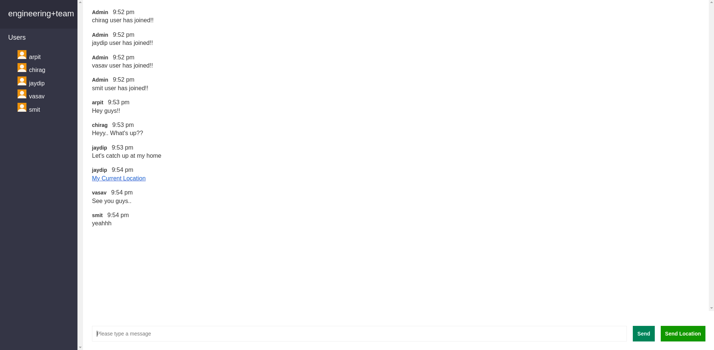

# Chat app using Node.js and socket.io

A chat application built with Node.js, Express, and socket.io where users can join private chat room and connect with other users. They
can send/receive messages and also share their current location with other users.

## Features

- User can join private chat room
- User can get a message when new user is joined/left the chat room
- User can send messages to other users which are in same private chat room in real time
- User can receive messages from other users which are in same private chat room in real time
- User can share his/her current location with other users

## Application preview

### Home page


### Chat room page


## Built Using

- [NodeJs](https://nodejs.org/en/) - Server Environment
- [Socket.io](https://socket.io/) - Communication channel between server and client
- [Express](https://expressjs.com/) - Server Framework


## Installing

The following instructions will get you a copy of the project and all the setting needed to run it on your local machine.

### Clone

Clone this repository to your local machine


```
$ git clone https://github.com/arpitptl/chat-app.git
```


### Setup

**1. Enter the project folder**

```
$ cd chat-app
```

**2. Install npm packages**

```
$ npm install
```

**3. Activate the server**

```
$ npm run dev
```
